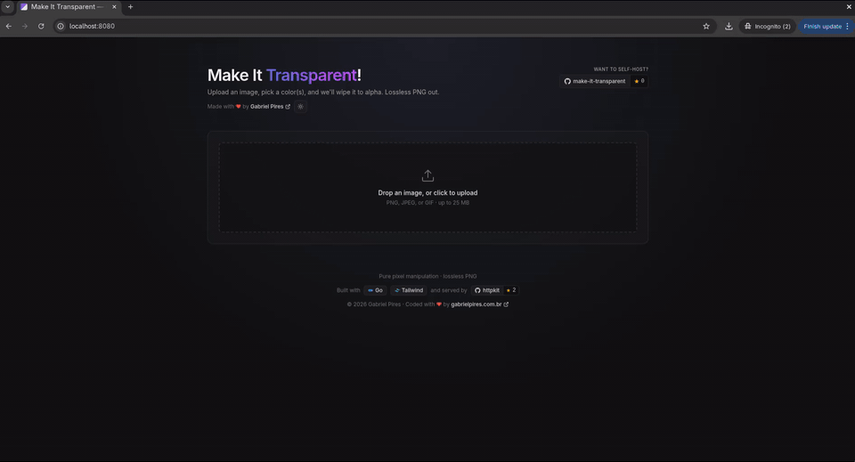

# Make It Transparent

[](https://github.com/gabrielpires/make-it-transparent/actions/workflows/ci.yml)
[](https://pkg.go.dev/github.com/gabrielpires/make-it-transparent)
[](https://goreportcard.com/report/github.com/gabrielpires/make-it-transparent)
[](LICENSE)
[](https://github.com/gabrielpires/httpkit)

> **Make It Transparent** is a simple tool to help you quickly remove colors
> from images. It was born from my frustration of searching online tools to
> do this and always hitting sites that are paid, give you a sample of the
> image with transparency, are gated by login, or wedge a watermark over the
> result. Making an image transparent should be simple and fast. Here is my
> contribution.

You can use it on the website **<https://transparent.gabrielpires.com>** or
download and run it locally.

---

## Demo



---

## Highlights

- **Pixel-pure**: no lossy compression on the colour data. Output is PNG
  encoded with `png.NoCompression`.
- **Multiple colors**: pick up to 8 colours, each with its own tolerance.
- **Eyedropper**: click anywhere on the original to sample a pixel.
- **No accounts, no telemetry, no upload retention** — requests are processed
  in memory and discarded.
- **Light and dark mode** with system-preference detection.
- **One static binary**, frontend embedded via `go:embed`. Self-host in seconds.

## Install

Pick whichever fits. All three target the same app on `http://localhost:8080`.
Run `make` (no arguments) at any time to list every available target.

### Option 1 — Run locally from source

Requires **Go ≥ 1.25**.

```bash
git clone https://github.com/gabrielpires/make-it-transparent.git
cd make-it-transparent
make run
```

### Option 2 — Run Docker, building from source

Requires **Docker**. Builds the image (17 MB, distroless, runs as `nonroot`)
and starts a container in one go.

```bash
git clone https://github.com/gabrielpires/make-it-transparent.git
cd make-it-transparent
make docker-run            # builds + runs, → http://localhost:8080
make docker-logs           # tail logs
make docker-stop           # stop the container
```

### Option 3 — Run the published image from GHCR

No clone, no build. Pulls the prebuilt multi-arch image (`linux/amd64` +
`linux/arm64`) from GitHub Container Registry:

```bash
docker run --rm -p 8080:8080 ghcr.io/gabrielpires/make-it-transparent:latest
```

For a long-running, hardened deployment (read-only root FS, `cap_drop: ALL`,
`no-new-privileges`, tmpfs spool, RAM/CPU ceilings), grab the bundled
`compose.yaml` and:

```bash
curl -O https://raw.githubusercontent.com/gabrielpires/make-it-transparent/main/compose.yaml
docker compose up -d
```

Bind to `127.0.0.1` (the default in `compose.yaml`) and front it with
Caddy/nginx/Cloudflare Tunnel for TLS.

### Flags

| Flag    | Default  | Description                |
|---------|----------|----------------------------|
| `-port` | `:8080`  | Listen address (`:n`)      |

### Limits & guardrails

| Limit                    | Value             | Where                                  |
|--------------------------|-------------------|----------------------------------------|
| Upload size              | 25 MiB            | `handler.DefaultLimits().MaxUploadBytes` |
| Decoded image area       | 16 megapixels     | `transparent.MaxPixels` (decompression-bomb guard) |
| Colours per request      | 16                | `handler.MaxColors`                    |
| Tolerance range          | 0–442             | `transparent.MaxTolerance` (Euclidean RGB) |

## How it works

```
upload → decode (PNG/JPEG/GIF) → normalise to NRGBA via draw.Src
       → for each pixel, if any (Δr² + Δg² + Δb²) ≤ tolᵢ²: alpha=0
       → encode PNG (no compression)
```

Per-pixel matching uses squared Euclidean RGB distance against each chosen
colour's own tolerance. The match short-circuits as soon as one target hits.
Sources living in `internal/transparent`.

## API

`POST /api/transparent` — multipart form:

| Field       | Repeated? | Notes |
|-------------|-----------|-------|
| `image`     | no        | PNG, JPEG, or GIF (up to 25 MiB). |
| `color`     | yes       | Hex string (`#RRGGBB` or `#RGB`). Comma-separated values inside a single field are also accepted. |
| `tolerance` | yes       | Paired with `color` by index (0–442). If fewer tolerances than colours, missing entries default to 10. |

Response: `image/png` (or `application/json` `{ "error": "…" }` on failure).

```bash
curl -X POST https://transparent.gabrielpires.com/api/transparent \
  -F "image=@cat.jpg" \
  -F "color=#ff00aa" -F "tolerance=0" \
  -F "color=#ffffff" -F "tolerance=20" \
  -o cat-transparent.png
```

## Self-hosting

The whole app — frontend included — is a single static binary. A minimal
`Caddyfile` for putting it behind TLS:

```Caddyfile
transparent.example.com {
  reverse_proxy 127.0.0.1:8080
}
```

`httpkit` also ships with `WithTLS(cert, key)` and `WithSelfAssignedCert()` if
you'd rather skip the proxy.

## Development

Most things are wrapped in the [Makefile](Makefile). Run `make` to list every
target.

```bash
make ci          # vet + race tests (what GitHub Actions runs)
make test        # race tests + coverage summary
make bench       # benchmarks only
make fuzz        # 30-second fuzz on ParseHex
make lint        # golangci-lint (if installed)
make fmt         # gofmt -w
make tidy        # go mod tidy
make gen-og      # regenerate web/og.png
make clean       # remove built binary + coverage
```

For Docker / Compose / multi-arch:

```bash
make docker-build               # build local image
make docker-run PORT=9000       # build + run on a custom port
make docker-buildx              # multi-arch (amd64 + arm64) — requires buildx
make compose-up                 # docker compose up -d --build
```

## Layout

```
.
├── main.go                # httpkit server + middleware
├── cmd/gen-og/            # generates web/og.png
├── web/                   # frontend (embedded via go:embed)
│   ├── index.html         # Tailwind via CDN, vanilla JS
│   ├── favicon.svg
│   ├── og.png
│   ├── robots.txt
│   └── sitemap.xml
└── internal/
    ├── transparent/       # pure pixel-manipulation core (no HTTP)
    └── handler/           # multipart parsing, validation, encoding
```

## Security

Vulnerabilities? Please don't open a public issue — see
[SECURITY.md](SECURITY.md).

## License

[PolyForm Noncommercial 1.0.0](LICENSE) — free for personal, hobby, research,
and noncommercial use. For commercial licensing, get in touch:
<eu@gabrielpires.com.br>.

## Author

Made with ♥ by [Gabriel Pires](https://gabrielpires.com.br).

---

> Built with AI agent support.
